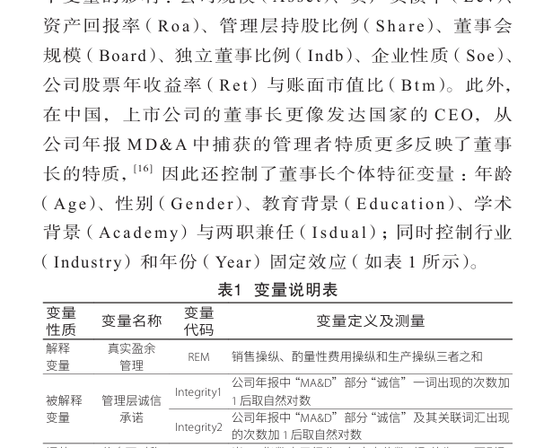
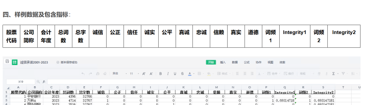

# Dataset for Corporate Integrity Commitments (2000-2023).xlsx

5.21MB XLSX

I. Methodology: Following the approach of Professor Yan Ruosen from the "Nankai Management Review" (2023), 
(1) The number of times the term "Integrity" appears in the "MA&D" section of an annual report is increased by 1 and then taken as its natural logarithm 
(2) The number of times the term "Integrity" and related words appear in the "MA&D" section of an annual report is increased by 1 and then taken as its natural logarithm

II. Data Range: 62408 data points, involving over 5600 companies, including raw word frequency and final calculation results, which can be verified for accuracy!

III. References: Yan Ruosen, Zhou Rang. Corporate Annual Report MD&A's Integrity Commitments: Moral Disguise after True Earnings Management [J]. Nankai Management Review, 2023, 26(05):137-148.

## Image

Here is a pay link on Stripe ( https://buy.stripe.com/3cs8yP7sY87d0vu9AB ). Please contact me lonlonago@foxmail.com after funding $89, and I will send you a complete data files , thank you!

